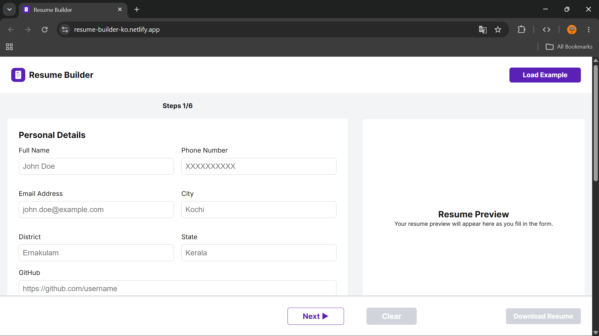
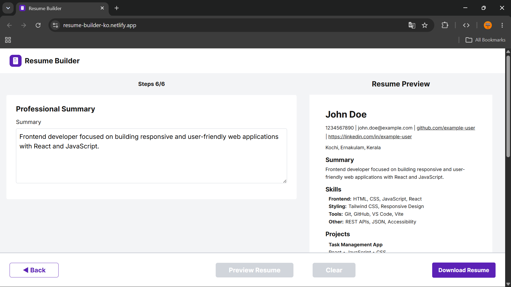

# Resume Builder

A responsive resume builder built with React that allows users to
create, preview, and download a professional resume as a PDF.

The project focuses on a simple multi-step form experience, responsive
layouts, resume preview, validation, and PDF generation.

## 🌐 Live Demo

**Live Demo:** https://resume-builder-ko.netlify.app/

## ✨ Features

-   Multi-step resume form
-   Personal details, summary, education, experience, projects, and
    skills sections
-   Form validation with section-specific error messages
-   Live resume preview
-   Responsive layout for mobile and desktop screens
-   PDF resume generation and download
-   Example resume data with **Load Example** for quickly testing the
    app
-   Clear/reset resume functionality
-   Resume data managed through custom React hooks

## 🛠️ Tech Stack

-   React 19
-   Vite
-   JavaScript
-   CSS
-   `@react-pdf/renderer`
-   `react-responsive`

## 📁 Project Structure

``` text
src/
├── assets/
├── components/
│   ├── Form/
│   │   ├── Education.jsx
│   │   ├── Experience.jsx
│   │   ├── FormResume.jsx
│   │   ├── PersonalDetails.jsx
│   │   ├── Projects.jsx
│   │   ├── Skills.jsx
│   │   └── Summary.jsx
│   ├── PdfResume.jsx
│   └── PreviewResume.jsx
├── data/
│   └── exampleResumeData.js
├── hooks/
│   ├── useResumeForm.js
│   └── useResumeSteps.js
├── styles/
│   ├── form.css
│   ├── global.css
│   ├── header.css
│   ├── preview.css
│   └── progress.css
├── utils/
│   └── validation.js
├── App.jsx
├── index.css
└── main.jsx
```

## 🚀 Getting Started

### 1. Clone the repository

``` bash
git clone https://github.com/adharshko-369z/Resume-Builder.git
```

### 2. Navigate to the project

``` bash
cd Resume-Builder
```

### 3. Install dependencies

``` bash
npm install
```

### 4. Start the development server

``` bash
npm run dev
```

Open the local URL shown by Vite in your browser.

## 📝 How to Use

1.  Fill in the resume details section by section.
2.  Use the **Next** button to move through the form.
3.  Complete the required fields.
4.  Open the resume preview.
5.  Review the generated resume.
6.  Download the resume as a PDF.
7.  Use **Clear** to reset the application and start again.

### Quick Demo

If you want to test the application without manually filling every
field, click **Load Example**.

This loads sample resume data so the preview and PDF features can be
tested immediately.

## 📄 PDF Generation

The project uses `@react-pdf/renderer` to generate the resume as a PDF.

The same resume data is passed to both the preview component and PDF
component so the generated document reflects the entered information.

## 📱 Responsive Design

The application supports different layouts for smaller and larger
screens.

-   Mobile: form and preview are shown as separate stages.
-   Desktop: form and resume preview are displayed together.
-   The layout adapts around the `1024px` desktop breakpoint.

## 🧠 What I Learned

While building this project, I practiced:

-   Building a multi-step React form
-   Managing complex nested form state
-   Creating reusable custom hooks
-   Passing data between components
-   Section-level validation
-   Conditional rendering
-   Responsive UI design
-   Generating PDFs from React data
-   Designing a portfolio project around a real user workflow
-   Structuring a React project into components, hooks, data, styles,
    and utilities

## 📸 Screenshots

### Desktop

<p align="center">
  
  
</p>

### Mobile

<p align="center">
  
  
</p>

## 👤 Author

**Adharsh K O**

Frontend Developer / React Developer

-   GitHub: https://github.com/adharshko-369z
-   LinkedIn: https://www.linkedin.com/in/adharsh-k-9ab8452a5/
